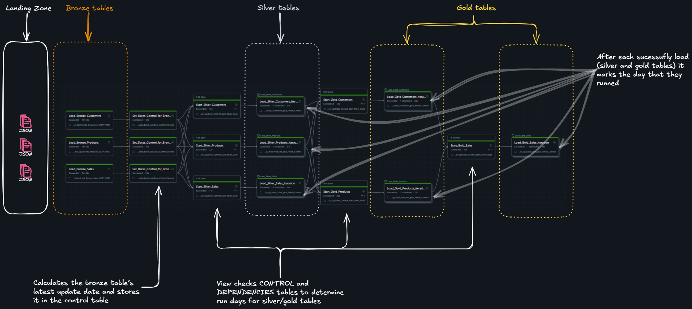

# First solution: *pure SQL notebooks*

The objectives are:

- Define tables and views to control data movement dates  
- Create `tasks` to manage date-based loads  
- Explore the use of `COPY INTO` (considered a legacy approach compared to Auto Loader for pure SQL solutions)  
- Define **quarantine tables** and a mechanism to re-ingest quarantined data  
- Use Databricks **Workflows** to orchestrate tasks (via notebooks)  
  - The approach is to have one job per project, establishing dependencies and using ```FOR EACH``` to process tasks incrementally — one day at a time — whenever possible.
  - Develop the job directly from the YAML file rather than the UI — this approach is faster, easier to maintain, and offers a clearer overall view of the job structure.
- Leverage the following tools for development:
  - **Databricks Asset Bundles**
  - **Databricks Connect**
  - **GitHub**
  - **VS Code**

## Context
The problem itshelf was described [here](README.md). This figure represents the challenger.


## Solution
This is a print screen of the job with comments.



### Lineage of the fact table


### Code

You can find all [notebooks here](notebooks/batch_sql) and the [job here](jobs/retail_batch_sql.yml)
