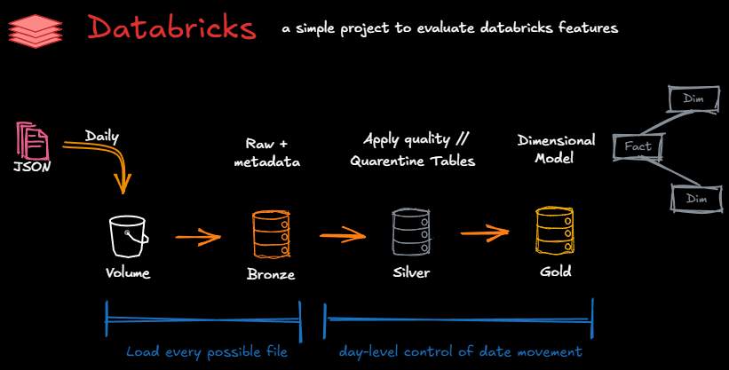

# Databricks – Basic Retail Project

The goal of this project is to explore and evaluate key Databricks capabilities through a retail sales use case.  
The scope includes:

- Developing notebooks using **SQL**, **Python**, and **Delta Live Tables** (declarative pipelines)  
- Managing data updates with **day-level precision** (movement control)  
- Implementing **CI/CD** workflows — including unit tests, integration tests, and **GitHub Actions** automation  
- Exploring **metadata-driven pipelines** for flexible and configurable data ingestion

---
## 🔗 Links 🔗

* 🔗 [Short description of the overall project](#short-description-of-the-overall-project) - *requirements and data modeling.*  
* 🔗 [First approach](First_solution.md) - *pure SQL notebooks within a single job (workflow) using DAB, implementing day-level movement control*

## Short description of the overall project

### Requirements (High Level)

1. **Daily Batch Input**  
   We will receive daily batches of JSON files (generated in Python) in the following formats:
   - `YYYY-MM-DD_Customer.json`
   - `YYYY-MM-DD_Products.json`
   - `YYYY-MM-DD_Sales.json`

2. **Date Control**  
   We need fine-grained control over the processing dates according to the operational source system.  
   For example: *Up to which date has the data mart (or table itself) been updated?*

---

### Design Process

#### 1. Select the Business Process to Model
The business process chosen for this case study is **retail sales**.  
The dataset will allow us to analyze:
- Which products are sold
- In what quantity
- To which customers
- At what price
- On which date and time

#### 2. Define the Grain
We define the grain as **a single product sold**, representing the most granular data available from the operational system.

#### 3. Choose the Dimensions
The descriptive dimensions for this model are:
- **Product**
- **Customer**
- **Date**

#### 4. Identify the Facts
The fact table will represent **individual sales items**.

